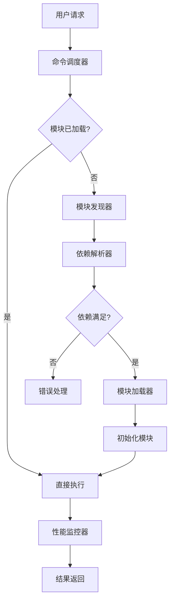

# 📋 规则管理系统 (Rule Management System)

*版本: v3.0.0 | 最后更新: {{GENERATION_TIME}} | 作者: {{AUTHOR_NAME}} <{{AUTHOR_EMAIL}}>*

## 🎯 核心使命 (Core Mission)

规则管理系统是.cursor规则体系的管理和协调中心，负责：

- **规则依赖管理**：维护规则间的引用关系和依赖层次
- **激活控制机制**：管理规则的启用、停用和条件激活
- **系统协调功能**：确保规则间的协作和冲突避免
- **扩展机制支持**：提供规则创建、集成和扩展的标准方法
- **文档化管理**：维护规则系统的完整文档和使用指南

## 🏛️ 系统架构 (System Architecture)

### 管理器组件 (Manager Components)

```
统一模块管理器 (Module Manager)
├── 📦 模块注册表 (Module Registry)      # 模块元数据和状态管理
├── 🔍 模块发现器 (Module Discoverer)    # 自动发现可用模块
├── ⚖️ 依赖解析器 (Dependency Resolver)  # 解决模块依赖关系
├── 🚀 模块加载器 (Module Loader)        # 动态加载和初始化模块
├── 🎮 命令调度器 (Command Dispatcher)   # 路由和执行模块命令
├── 📊 性能监控器 (Performance Monitor)  # 监控模块性能指标
├── 🔧 配置管理器 (Configuration Manager)# 统一配置管理
└── 👤 用户界面 (User Interface)         # 配置和控制界面
```

### 数据流 (Data Flow)



## 📦 模块注册表 (Module Registry)

### 注册表结构 (Registry Structure)
```json
{
  "registry": {
    "version": "1.0.0",
    "last_updated": "2025-12-21T12:06:50+08:00",
    "modules": {
      "eslint_integration": {
        "metadata": {
          "name": "eslint_integration",
          "version": "1.0.0",
          "type": "optional",
          "status": "active"
        },
        "capabilities": ["code_quality", "file_processing"],
        "dependencies": ["system_info"],
        "compatibility": {
          "platforms": ["linux", "macos", "windows"],
          "min_version": "14.0.0"
        },
        "performance": {
          "load_time": 150,
          "memory_usage": 25,
          "success_rate": 0.98
        }
      }
    },
    "categories": {
      "code_quality": ["eslint_integration", "prettier_integration"],
      "version_control": ["git_integration", "svn_integration"],
      "communication": ["slack_integration", "teams_integration"]
    }
  }
}
```

### 注册表操作 (Registry Operations)

#### 模块注册 (Module Registration)
```typescript
interface ModuleRegistry {
  register(modulePath: string): Promise<ModuleEntry>;
  unregister(moduleName: string): Promise<boolean>;
  update(moduleName: string, metadata: ModuleMetadata): Promise<boolean>;
  query(filter?: ModuleFilter): Promise<ModuleEntry[]>;
  getCategories(): Promise<string[]>;
  getByCategory(category: string): Promise<ModuleEntry[]>;
}
```

#### 状态管理 (State Management)
```json
{
  "module_states": {
    "active": ["eslint_integration", "git_integration", "i18n_support"],
    "inactive": ["heavy_analysis_tools", "legacy_tools"],
    "failed": ["broken_module"],
    "pending": ["downloading_module"]
  }
}
```

## 🔍 模块发现器 (Module Discoverer)

### 发现策略 (Discovery Strategies)

#### 文件系统发现 (Filesystem Discovery)
```typescript
class FilesystemDiscoverer implements ModuleDiscoverer {
  private readonly searchPaths = [
    '.cursor/rules/',  // 实际存在的规则目录
    '~/.cursor/rules', // 用户个人规则目录（如果存在）
    './.cursor/rules'  // 项目本地规则目录
  ];

  async discover(): Promise<ModuleCandidate[]> {
    const candidates: ModuleCandidate[] = [];

    for (const searchPath of this.searchPaths) {
      const expandedPath = this.expandPath(searchPath);
      if (await this.directoryExists(expandedPath)) {
        const modules = await this.scanDirectory(expandedPath);
        candidates.push(...modules);
      }
    }

    return candidates;
  }

  private async scanDirectory(dirPath: string): Promise<ModuleCandidate[]> {
    const modules: ModuleCandidate[] = [];
    const entries = await this.readDirectory(dirPath);

    for (const entry of entries) {
      if (entry.isDirectory) {
        const modulePath = path.join(dirPath, entry.name);
        const metadataPath = path.join(modulePath, 'module.json');

        if (await this.fileExists(metadataPath)) {
          const metadata = await this.loadMetadata(metadataPath);
          modules.push({
            path: modulePath,
            metadata,
            source: 'filesystem'
          });
        }
      }
    }

    return modules;
  }
}
```

#### 规则共享机制 (Rule Sharing Mechanism)
```json
{
  "rule_sharing": {
    "community_repositories": [
      {
        "name": "cursor_ai_rules_github",
        "url": "https://github.com/saidada(cursor-ai-rules)",
        "description": "官方Cursor AI规则仓库",
        "type": "git"
      },
      {
        "name": "community_contributions",
        "url": "https://github.com/topics/cursor-rules",
        "description": "社区贡献的规则集合",
        "type": "github_topics"
      }
    ],
    "sharing_guidelines": {
      "license_requirement": "MIT or compatible",
      "documentation_standard": "Include RULE.md and usage examples",
      "testing_requirement": "Provide test cases or usage examples"
    }
  }
}
```

## ⚖️ 依赖解析器 (Dependency Resolver)

### 依赖图构建 (Dependency Graph Construction)
```typescript
class DependencyResolver {
  private graph: Map<string, ModuleNode> = new Map();

  async resolve(moduleName: string): Promise<ResolutionResult> {
    const module = await this.registry.get(moduleName);
    if (!module) {
      throw new Error(`Module ${moduleName} not found`);
    }

    // 构建依赖图
    await this.buildDependencyGraph(module);

    // 检测循环依赖
    const cycles = this.detectCycles();
    if (cycles.length > 0) {
      throw new Error(`Circular dependencies detected: ${cycles.join(', ')}`);
    }

    // 拓扑排序确定加载顺序
    const loadOrder = this.topologicalSort();

    // 验证兼容性
    await this.validateCompatibility(loadOrder);

    return {
      loadOrder,
      conflicts: [],
      warnings: []
    };
  }

  private async buildDependencyGraph(module: ModuleEntry): Promise<void> {
    const queue = [module];
    const visited = new Set<string>();

    while (queue.length > 0) {
      const current = queue.shift()!;
      const name = current.metadata.name;

      if (visited.has(name)) continue;
      visited.add(name);

      const node: ModuleNode = {
        module: current,
        dependencies: [],
        dependents: []
      };

      // 处理必需依赖
      for (const depName of current.metadata.dependencies.required || []) {
        const depModule = await this.registry.get(depName);
        if (depModule) {
          node.dependencies.push(depModule);
          queue.push(depModule);
        }
      }

      this.graph.set(name, node);
    }
  }
}
```

### 冲突检测和解决 (Conflict Detection and Resolution)
```json
{
  "conflict_resolution": {
    "version_conflicts": {
      "strategy": "highest_compatible",
      "fallback": "manual_selection"
    },
    "capability_conflicts": {
      "strategy": "merge_capabilities",
      "override_rules": {
        "eslint": "prefer_newer",
        "git_hooks": "allow_multiple"
      }
    },
    "resource_conflicts": {
      "memory_limit": "resolve_by_priority",
      "port_usage": "auto_assign"
    }
  }
}
```

## 🚀 模块加载器 (Module Loader)

### 加载策略 (Loading Strategies)

#### 即时加载 (Immediate Loading)
```typescript
class ImmediateLoader implements ModuleLoader {
  async load(moduleName: string): Promise<ModuleInstance> {
    const module = await this.registry.get(moduleName);
    if (!module) {
      throw new Error(`Module ${moduleName} not found`);
    }

    // 检查缓存
    const cached = this.cache.get(moduleName);
    if (cached && this.isCacheValid(cached, module)) {
      return cached.instance;
    }

    // 解析依赖
    const resolution = await this.resolver.resolve(moduleName);

    // 按顺序加载依赖
    for (const depName of resolution.loadOrder) {
      if (depName !== moduleName) {
        await this.load(depName);
      }
    }

    // 加载主模块
    const instance = await this.loadModuleInstance(module);

    // 缓存实例
    this.cache.set(moduleName, {
      instance,
      timestamp: Date.now(),
      metadata: module.metadata
    });

    return instance;
  }
}
```

#### 懒加载 (Lazy Loading)
```typescript
class LazyLoader implements ModuleLoader {
  private loadingPromises: Map<string, Promise<ModuleInstance>> = new Map();

  async load(moduleName: string): Promise<ModuleInstance> {
    if (this.loadingPromises.has(moduleName)) {
      return this.loadingPromises.get(moduleName)!;
    }

    const loadPromise = this.performLazyLoad(moduleName);
    this.loadingPromises.set(moduleName, loadPromise);

    return loadPromise;
  }

  private async performLazyLoad(moduleName: string): Promise<ModuleInstance> {
    // 延迟加载逻辑
    await this.delay(100); // 模拟网络延迟或其他准备时间

    const module = await this.registry.get(moduleName);
    if (!module) {
      throw new Error(`Module ${moduleName} not found`);
    }

    return this.loadModuleInstance(module);
  }
}
```

### 加载优化 (Loading Optimization)

#### 并行加载 (Parallel Loading)
```typescript
class ParallelLoader implements ModuleLoader {
  async load(moduleName: string): Promise<ModuleInstance> {
    const resolution = await this.resolver.resolve(moduleName);

    // 构建加载任务图
    const loadTasks = new Map<string, Promise<ModuleInstance>>();

    // 并行加载所有依赖
    const dependencyPromises = resolution.loadOrder
      .filter(name => name !== moduleName)
      .map(async (depName) => {
        const promise = this.load(depName);
        loadTasks.set(depName, promise);
        return promise;
      });

    // 等待所有依赖加载完成
    await Promise.all(dependencyPromises);

    // 加载主模块
    const instance = await this.loadModuleInstance(
      await this.registry.get(moduleName)
    );

    return instance;
  }
}
```

## 🎮 命令调度器 (Command Dispatcher)

### 命令路由 (Command Routing)
```typescript
class CommandDispatcher {
  private routes: Map<string, CommandRoute> = new Map();

  registerRoute(commandName: string, moduleName: string, methodName: string): void {
    this.routes.set(commandName, {
      module: moduleName,
      method: methodName,
      capabilities: this.getModuleCapabilities(moduleName)
    });
  }

  async dispatch(command: Command): Promise<CommandResult> {
    const route = this.routes.get(command.name);
    if (!route) {
      throw new Error(`Command ${command.name} not found`);
    }

    // 检查模块是否已加载
    const moduleInstance = await this.loader.load(route.module);

    // 执行命令
    const result = await moduleInstance.execute(route.method, command.params);

    // 记录执行统计
    await this.recordExecutionStats(command, result);

    return result;
  }
}
```

### 命令队列管理 (Command Queue Management)
```typescript
interface CommandQueue {
  add(command: Command): Promise<string>; // 返回命令ID
  cancel(commandId: string): Promise<boolean>;
  getStatus(commandId: string): Promise<CommandStatus>;
  getQueue(): Promise<Command[]>;
  prioritize(commandId: string): Promise<boolean>;
}

class PriorityCommandQueue implements CommandQueue {
  private queue: PriorityQueue<QueuedCommand> = new PriorityQueue();

  async add(command: Command): Promise<string> {
    const queuedCommand: QueuedCommand = {
      id: this.generateId(),
      command,
      priority: this.calculatePriority(command),
      timestamp: Date.now(),
      status: 'queued'
    };

    this.queue.enqueue(queuedCommand, queuedCommand.priority);
    return queuedCommand.id;
  }

  private calculatePriority(command: Command): number {
    // 基于命令类型、用户角色、紧急程度等计算优先级
    let priority = 0;

    if (command.urgent) priority += 100;
    if (command.userRole === 'admin') priority += 50;
    if (command.type === 'system_maintenance') priority += 25;

    return priority;
  }
}
```

## 📊 性能监控器 (Performance Monitor)

### 监控指标 (Monitoring Metrics)
```json
{
  "performance_metrics": {
    "module_performance": {
      "load_time": {
        "eslint_integration": 150,
        "git_integration": 80,
        "i18n_support": 45
      },
      "memory_usage": {
        "eslint_integration": 25,
        "git_integration": 15,
        "i18n_support": 8
      },
      "cpu_usage": {
        "eslint_integration": 5.2,
        "git_integration": 2.1,
        "i18n_support": 1.8
      }
    },
    "command_performance": {
      "execution_time": {
        "eslint_check": 1200,
        "git_commit": 800,
        "file_save": 200
      },
      "success_rate": {
        "eslint_check": 0.98,
        "git_commit": 0.95,
        "file_save": 0.99
      },
      "error_rate": {
        "eslint_check": 0.02,
        "git_commit": 0.05,
        "file_save": 0.01
      }
    },
    "system_resources": {
      "total_memory": 8192,
      "used_memory": 2048,
      "available_memory": 6144,
      "cpu_cores": 8,
      "load_average": 2.5
    }
  }
}
```

### 性能优化策略 (Performance Optimization Strategies)

#### 缓存策略 (Caching Strategies)
```json
{
  "caching_strategies": {
    "module_cache": {
      "ttl": "1h",
      "invalidation_events": ["module_update", "config_change"],
      "max_size": "100MB"
    },
    "command_cache": {
      "ttl": "5m",
      "cacheable_commands": ["status_check", "info_query"],
      "exclude_patterns": ["*write*", "*modify*"]
    },
    "metadata_cache": {
      "ttl": "24h",
      "compression": true,
      "persistent": true
    }
  }
}
```

#### 资源管理 (Resource Management)
```typescript
class ResourceManager {
  private limits = {
    maxConcurrentModules: 10,
    maxMemoryPerModule: 50 * 1024 * 1024, // 50MB
    maxCpuPerModule: 10, // 10%
    timeoutPerCommand: 30000 // 30秒
  };

  async allocateResources(moduleName: string): Promise<ResourceAllocation> {
    const currentUsage = await this.getCurrentUsage();

    if (currentUsage.activeModules >= this.limits.maxConcurrentModules) {
      throw new Error('Maximum concurrent modules limit reached');
    }

    return {
      memoryLimit: this.limits.maxMemoryPerModule,
      cpuLimit: this.limits.maxCpuPerModule,
      timeout: this.limits.timeoutPerCommand
    };
  }

  async monitorResources(): Promise<void> {
    setInterval(async () => {
      const usage = await this.getCurrentUsage();

      if (usage.memoryUsage > 0.8) {
        await this.triggerOptimization('memory');
      }

      if (usage.cpuUsage > 0.9) {
        await this.triggerOptimization('cpu');
      }
    }, 5000); // 每5秒检查一次
  }
}
```

## 🔧 配置管理器 (Configuration Manager)

### 当前配置机制 (Current Configuration Mechanism)

#### 规则级配置 (Rule-level Configuration)
每个规则通过其`RULE.md`文件顶部的元数据进行配置：

```markdown
---
description: "规则描述"
alwaysApply: true/false  # 是否自动激活
---
```

#### 项目级配置 (Project-level Configuration)
- 通过创建/删除规则目录来控制规则激活
- 通过修改规则文件内容来调整规则行为
- 通过引用语法(`@规则名`)建立规则间依赖

#### 用户级配置 (User-level Configuration)
- 用户可以通过复制和修改规则来自定义行为
- 通过创建个人规则目录扩展功能
- 通过选择性激活规则来适应工作习惯

### 配置合并策略 (Configuration Merge Strategy)
```typescript
class ConfigurationManager {
  async getConfiguration(moduleName: string, key: string): Promise<any> {
    const configs = await this.loadConfigurationHierarchy();

    // 从低到高优先级查找配置
    for (const config of configs.reverse()) {
      if (config.modules?.[moduleName]?.[key] !== undefined) {
        return config.modules[moduleName][key];
      }
    }

    // 返回默认值
    return this.getDefaultValue(moduleName, key);
  }

  async setConfiguration(moduleName: string, key: string, value: any): Promise<void> {
    const userConfig = await this.loadUserConfig();

    if (!userConfig.modules) {
      userConfig.modules = {};
    }

    if (!userConfig.modules[moduleName]) {
      userConfig.modules[moduleName] = {};
    }

    userConfig.modules[moduleName][key] = value;

    await this.saveUserConfig(userConfig);
  }
}
```

## 🧩 模块工具子系统 (Module Tools Subsystem)

### 模块架构 (Module Architecture)

#### 模块架构设计蓝图 (Module Architecture Blueprint)

**注意**: 以下目录结构是概念性设计，展示了模块化系统的理想组织方式。目前这些目录还不存在，是未来扩展时的目标架构。

```
当前规则的功能分类 (Current Rules by Function Category)

├── 基础设施层 (Infrastructure Layer)
│   ├── system_info/        # 系统信息获取 (✅ 已实现)
│   ├── platform_adapter/  # 跨平台适配 (✅ 已实现)
│   └── i18n/              # 国际化支持 (✅ 已实现)
├── 开发工具层 (Development Tools Layer)
│   ├── eslint/            # JavaScript代码质量检查 (✅ 已实现)
│   ├── intelligent_evolution/ # 智能感知系统 (✅ 已实现)
│   └── generator/         # 规则生成器 (✅ 已实现)
├── 演进管理层 (Evolution Management Layer)
│   ├── evolution-philosophy/  # 演进理念 (✅ 已实现)
│   ├── evolution-manual/     # 手动演进 (✅ 已实现)
│   ├── evolution-automation/ # 自动化演进 (✅ 已实现)
│   └── evolution-governance/ # 演进治理 (✅ 已实现)
└── 框架核心层 (Framework Core Layer)
    ├── constitution/      # AI共生宪法 (✅ 已实现)
    ├── philosophy/        # 协作哲学 (✅ 已实现)
    ├── templates/         # 配置模板框架 (✅ 已实现)
    └── module_manager/    # 规则管理系统 (✅ 当前文档)

注意：以上是功能分类的逻辑分组，实际文件都位于 .cursor/rules/ 目录下
```

**当前状态**: 上述模块功能已通过规则文件实现，但尚未模块化。每个功能都作为独立的RULE.md文件存在。

**当前架构状态**:
1. **规则文件组织**: 所有功能以RULE.md文档形式存在
   - 每个规则都是独立的文档文件
   - 通过@引用语法实现规则间协作
   - 规则可通过文件名激活/停用

2. **功能完整性**: 核心功能已全部实现
   - 所有标注的功能都已通过现有规则文档实现
   - 无"待实现"的功能，所有都是可用的

3. **架构优势**: 当前设计天然具备模块化特征
   - 规则文件本身就是模块化的单元
   - 可以独立维护、测试和扩展
   - 支持条件激活和按需加载

#### 当前规则依赖关系 (Current Rule Dependencies)
```json
{
  "rule_dependencies": {
    "foundation": {
      "description": "基础框架层",
      "rules": ["constitution"],
      "dependents": ["所有其他规则"]
    },
    "collaboration": {
      "description": "协作层",
      "rules": ["philosophy"],
      "depends_on": ["constitution"],
      "dependents": ["所有协作相关规则"]
    },
    "infrastructure": {
      "description": "基础设施层",
      "rules": ["system_info", "platform_adapter", "i18n"],
      "depends_on": ["constitution"],
      "dependents": ["所有需要系统功能的规则"]
    },
    "tools": {
      "description": "工具层",
      "rules": ["eslint", "intelligent_evolution", "generator"],
      "depends_on": ["infrastructure"],
      "dependents": []
    },
    "evolution": {
      "description": "演进层",
      "rules": ["evolution-philosophy", "evolution-manual", "evolution-automation", "evolution-governance"],
      "depends_on": ["constitution", "intelligent_evolution"],
      "dependents": []
    }
  }
}
```

### 规则系统工作机制 (Rule System Working Mechanism)

#### 规则文件标准 (Rule File Standards)
每个规则都作为独立的`.cursor/rules/*/RULE.md`文档存在：

```markdown
---
description: "规则功能描述"
alwaysApply: true/false
---

# 规则标题

*版本: v3.0.0 | 最后更新: {{GENERATION_TIME}} | 作者: {{AUTHOR_NAME}} <{{AUTHOR_EMAIL}}>*

## 功能描述
<!-- 规则的详细功能说明 -->

## 使用方法
<!-- 如何使用该规则 -->
```

#### 规则激活机制 (Rule Activation Mechanism)
- **文件名激活**: 规则通过其所在目录名激活（如`@eslint`激活eslint规则）
- **条件引用**: 规则可通过`@规则名`语法被其他规则引用
- **alwaysApply**: 设置为true的规则始终激活，false的规则按需激活

### 规则激活控制 (Rule Activation Control)

#### 显式激活 (Explicit Activation)
- **目录存在**: 规则通过创建对应的`.cursor/rules/规则名/`目录激活
- **引用语法**: 在其他规则中通过`@规则名`引用来激活依赖规则
- **alwaysApply**: 在规则元数据中设置为true的规则自动激活

#### 隐式激活 (Implicit Activation)
- **按需加载**: 当其他规则引用某个规则时，该规则自动激活
- **上下文相关**: 根据项目特征和使用场景自动判断是否需要激活特定规则
- **用户控制**: 用户可以通过创建/删除规则目录来控制规则的启用和禁用

### 规则扩展机制 (Rule Extension Mechanism)

#### 新规则创建 (New Rule Creation)
创建新的规则只需在`.cursor/rules/`目录下创建新的规则目录和RULE.md文件：

```bash
# 创建新规则目录
mkdir .cursor/rules/my_custom_rule

# 创建规则文档
cat > .cursor/rules/my_custom_rule/RULE.md << 'EOF'
---
description: "我的自定义规则"
alwaysApply: false
---

# 我的自定义规则

*版本: v3.0.0 | 最后更新: {{GENERATION_TIME}} | 作者: {{AUTHOR_NAME}} <{{AUTHOR_EMAIL}}}*

## 功能描述
<!-- 描述规则的功能 -->

## 配置选项
<!-- 描述规则的配置选项 -->

## 使用方法
<!-- 描述如何使用该规则 -->
EOF
```

#### 规则集成方式 (Rule Integration Methods)
- **直接引用**: 在其他规则中使用`@my_custom_rule`引用
- **条件激活**: 根据项目需要选择性激活
- **协作扩展**: 通过与其他规则结合提供完整解决方案

## 👤 用户界面 (User Interface)

### 配置界面 (Configuration Interface)
```json
{
  "user_interface": {
    "dashboard": {
      "active_modules": ["eslint_integration", "git_integration", "i18n_support"],
      "system_status": "healthy",
      "performance_summary": {
        "total_modules": 15,
        "active_modules": 8,
        "memory_usage": "256MB",
        "cpu_usage": "12%"
      }
    },
    "module_browser": {
      "categories": {
        "code_quality": ["eslint", "prettier", "stylelint"],
        "collaboration": ["git_integration", "slack_integration"],
        "productivity": ["task_manager", "time_tracker"]
      },
      "filters": {
        "platform": ["linux", "macos", "windows"],
        "status": ["active", "inactive", "failed"],
        "rating": ["⭐⭐⭐⭐⭐", "⭐⭐⭐⭐", "⭐⭐⭐"]
      }
    },
    "settings": {
      "auto_discovery": true,
      "auto_update": "stable",
      "performance_monitoring": true,
      "telemetry": false
    }
  }
}
```

### 规则管理工具 (Rule Management Tools)
```bash
# 查看环境状态
./cursor/scripts/env_check.sh

# 检查代码质量（针对JavaScript项目）
./cursor/scripts/check.sh

# 启用特定规则
./cursor/scripts/enable.sh rule_name

# 管理插件（如果有的话）
./cursor/scripts/plugin_manager.sh
```

#### 手动规则管理 (Manual Rule Management)
```bash
# 激活规则：创建规则目录
mkdir .cursor/rules/my_rule
echo "# My Rule" > .cursor/rules/my_rule/RULE.md

# 停用规则：删除规则目录
rm -rf .cursor/rules/my_rule

# 查看活跃规则：列出规则目录
ls .cursor/rules/
```

---

*统一模块管理器是.cursor规则体系的管理和协调中心，提供规则间的依赖管理、激活控制和扩展机制，确保规则系统的有序运行和协作。*
